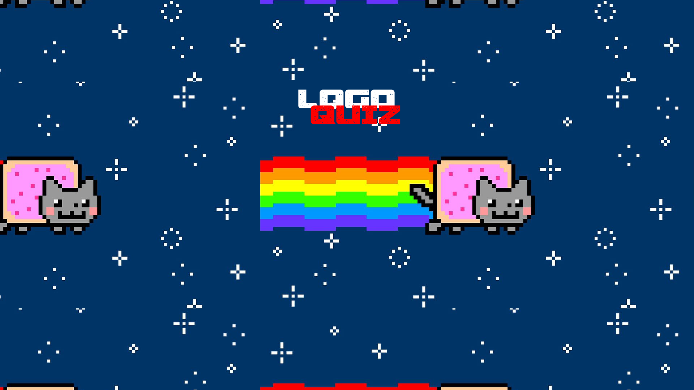
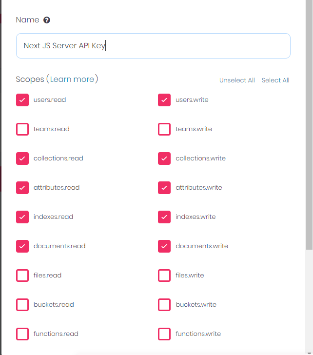

# PVP Logo Quiz

## Project setup guide

1. Install and run Appwrite.
2. Create a project on Appwrite.
3. Add a Web Platform to your project.
4. Head to API Keys section and create a new appwrite server key with the following permissions:
   The command will fail if you have not provided the necessary permissions.

   `users.read, users.write, collections.read, collections.write, attributes.read, attributes.write, indexes.read, indexes.write, documents.read, documents.write`.

   

5. Clone this repository
6. Create a copy of `.env.example` file. Rename it to `.env` and fill out the variables. You can find values for `APPWRITE_ENDPOINT, APPWRITE_PROJECT` on the Appwrite dashboard itself. `APPWRITE_SERVER_API_KEY` is the server API key secret that we generated. Rest of the variables will be generated by the setup script.

7. Run `yarn setup`. It will create the required collectoins and provide you with their unique IDs. Add them to your `.env` file. It will also add some logos to your database so you can get up and running instantly.
8. That's it. You can now run `yarn dev` and start playing.
